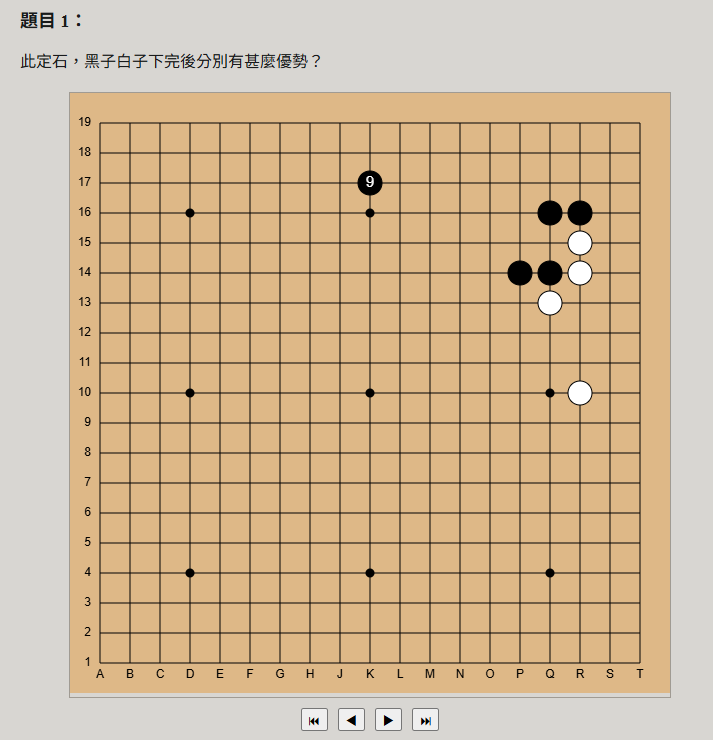
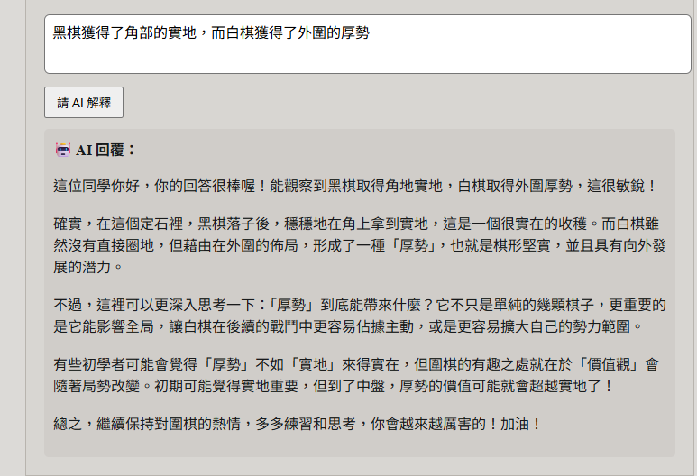

# 圍棋定石AI互動平台

一個以 React + Flask 實作的圍棋教學工具，幫助使用者透過與 AI 互動學習定石，培養良好的下棋直覺與判斷能力。

 ## 🚀 體驗入口

- 體驗網站：https://go-joseki-interactive.vercel.app
- ⏳ *由於後端使用免費平台，初次開啟可能需等待伺服器喚醒*
- 本專案後端已部署於 Render，透過 Flask 提供 API 服務（不開放直接存取）
  
## 📽️ 影片介紹

[](https://www.youtube.com/watch?v=kiUH-brnqGY)

👉 點擊圖片即可觀看完整介紹。

## 📸 平台截圖

<table>
  <tr>
    <td>
      
    </td>
    <td>
      
    </td>
  </tr>
  <tr>
    <td>
      平台棋盤樣式
    </td>
    <td>
      AI即時回饋功能
    </td>
  </tr>
</table>

## 功能特色

- 📚 題庫導覽：支援題目切換與目錄導覽
- ✏️ 定石填空：可填入後與AI互動，並即時判定對錯
- 🎞️ 棋譜回放：支援「一鍵到底」與「回到起手」
- 🌐 支援部署：可於 Render（後端）與 Vercel（前端）分別部署

## 技術架構

| 元件 | 技術 |
|------|------|
| 前端 | React + Vite |
| 後端 | Flask + Gemini API |
| 部署 | Render（API）+ Vercel（前端） |

## ⚙️ 進階用戶：本地執行方式

如欲自行測試前後端，可參考以下指令：

```bash
# 前端
cd frontend
npm install
npm run dev

# 後端
cd backend
pip install -r requirements.txt
python app.py
```
請自行設定 .env 以連接 Gemini API。

# 📄 License
本專案採用 MIT License 授權，詳見 LICENSE 檔案。

# 開發者
陳彥辰（專題設計、題庫設計、前後端整合）
